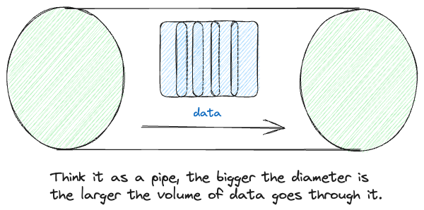
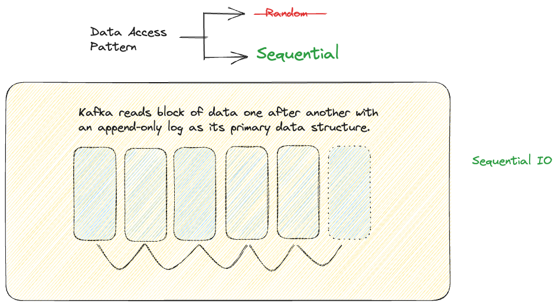
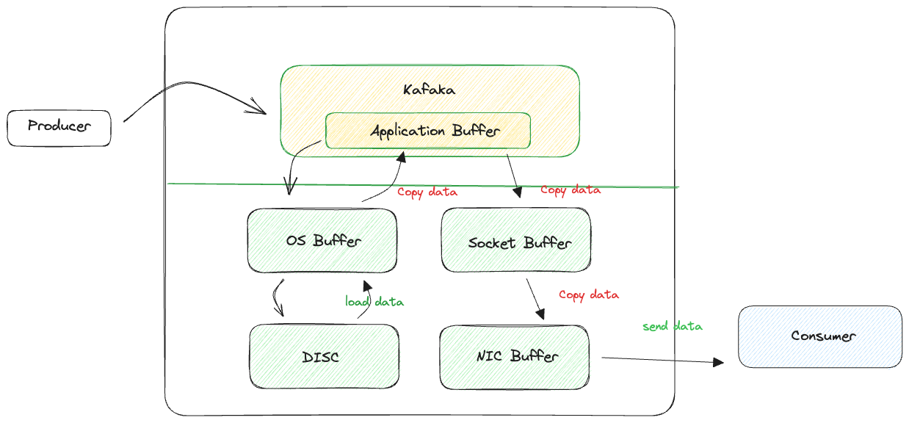
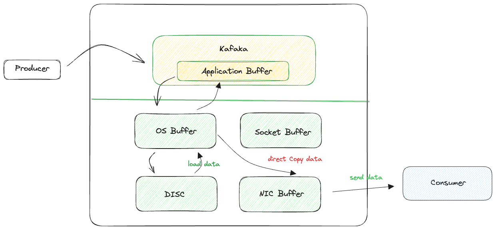

# Kafka

In software development, Kafka is often used to build real-time data pipelines and streaming applications. It allows you to publish and subscribe to streams of records, store those records in a fault-tolerant manner, and process them in real-time. It's particularly popular for handling large volumes of data in a scalable and efficient way.

## How does it work

## Data access pattern

## Without zero-copy principal

## With zero-copy principal

## Recap
The two major reasons why Kafka fast is because of sequentialIO and zero-copy principal. 